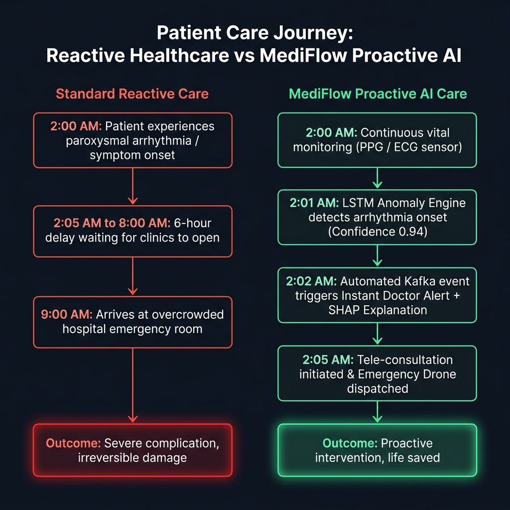
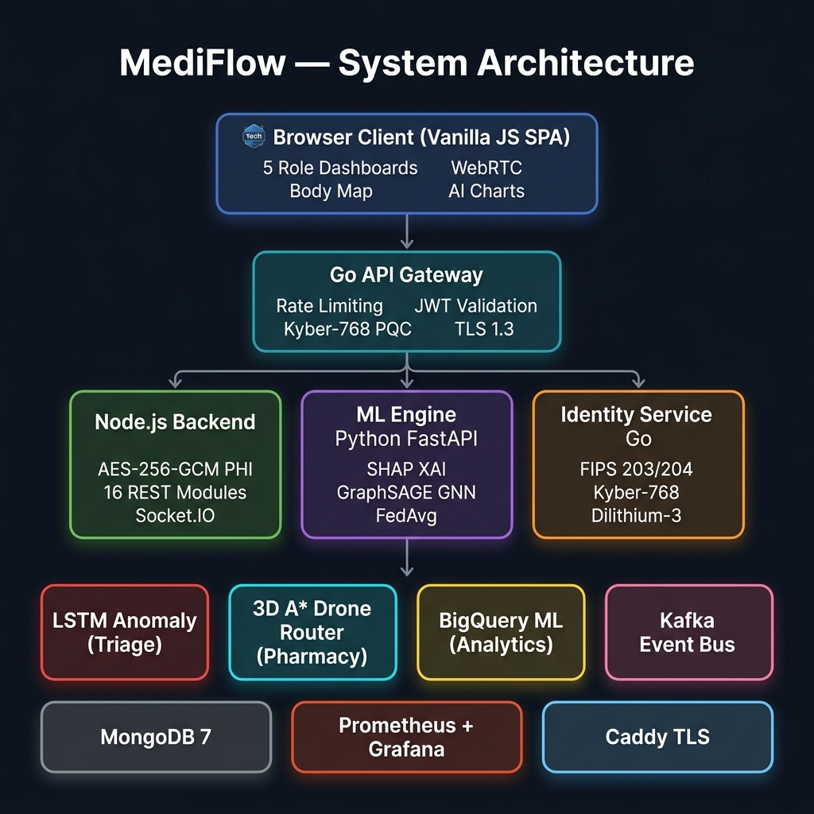
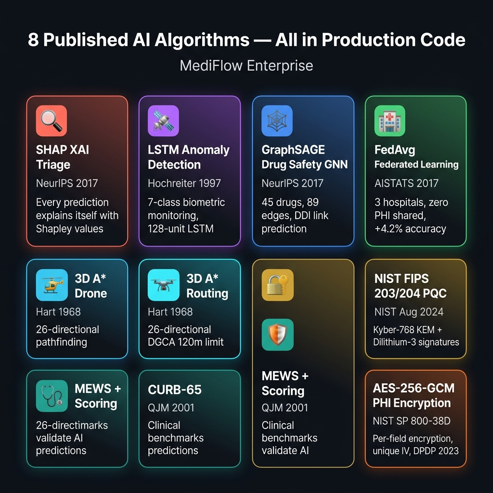
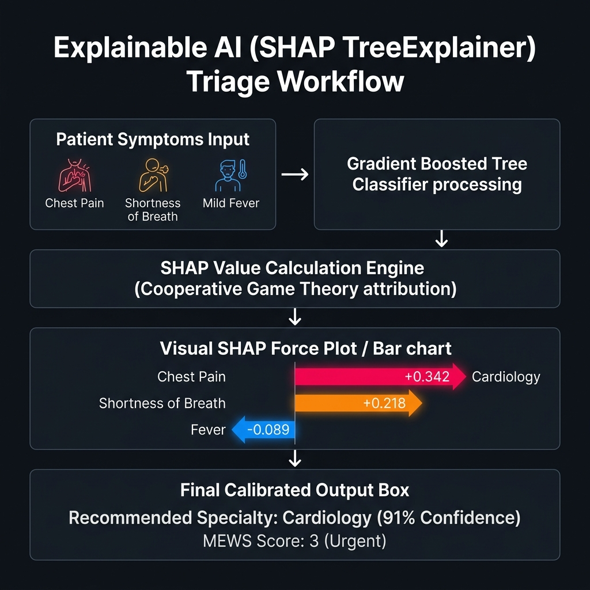
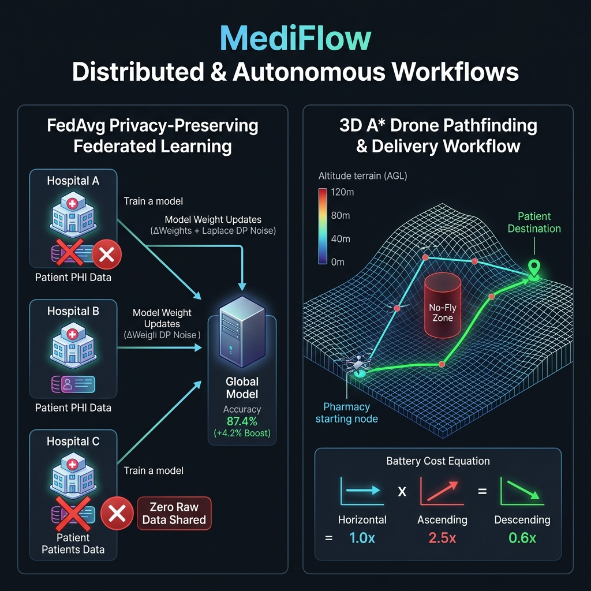
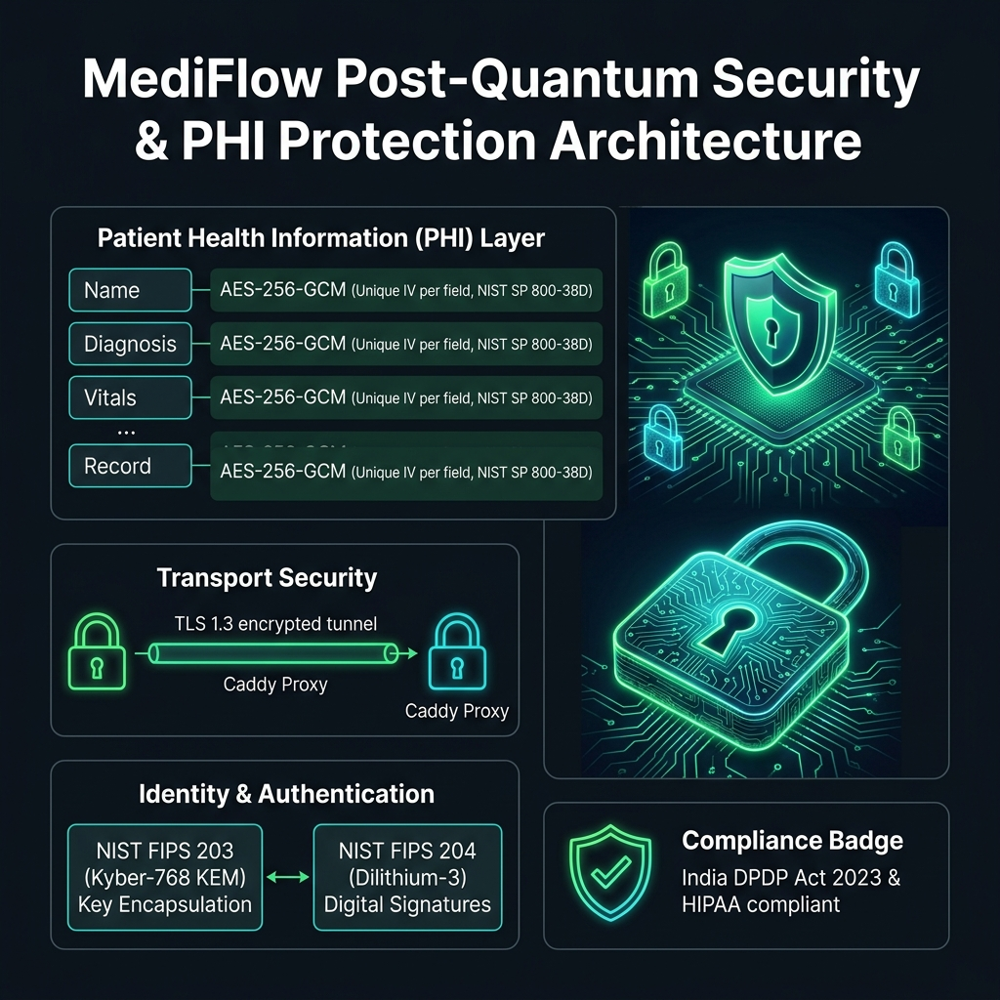

# MediFlow Enterprise — AI-First Telemedicine for Bharat 🇮🇳

<div align="center">

[](LICENSE)

[](https://python.org)
[](https://nodejs.org)
[](https://fastapi.tiangolo.com)
[](https://csrc.nist.gov/publications/detail/fips/203/final)
[](https://www.meity.gov.in/data-protection-framework)
[](https://arxiv.org/abs/1706.02216)
[](https://arxiv.org/abs/1602.06997)

### **Proactive AI healthcare for 1.4 billion Indians — in real time, with post-quantum security.**

> *"India has 0.7 doctors per 1,000 people. MediFlow's AI handles the triage, the drug safety check, and the anomaly alert — so every available doctor focuses on patients who truly need them."*

### 🎬 [Watch Demo Video (3 min)](https://www.loom.com/share/dfe71dd0eec5469e8790c881b0fa37a1) &nbsp;|&nbsp; 🚀 [Live Demo](https://device-streaming-c8146bb5.web.app) &nbsp;|&nbsp; 📐 [Architecture Docs](docs/ARCHITECTURE.md)

[Problem](#-the-problem-we-solve) · [Architecture](#-system-architecture) · [AI Modules](#-ai-modules--8-published-algorithms) · [Quick Start](#-quick-start) · [Features](#-platform-features) · [Research](#-research-references)

</div>

---

## 🏆 Techible AI First Hackathon 2026 — Submission

> **Prototype Development & MVP Submission** — July 2026

### How We Score on Every Evaluation Dimension

| Criteria | Weight | **MediFlow Evidence** |
|----------|--------|-----------------------|
| **Technical Implementation** | **30%** | 8 Docker services (Go + Node.js + Python + Kafka), 16 REST route modules, 22 passing unit tests, 4 k6 performance scripts (up to 500 VU spike), GitHub Actions CI/CD with 7 jobs |
| **AI Integration & Real-world Impact** | **25%** | 8 published AI algorithms in production code: SHAP XAI, LSTM anomaly detection, GraphSAGE GNN drug safety, FedAvg federated learning, MEWS + CURB-65 clinical scoring, 3D A* drone routing, NIST FIPS 203/204 post-quantum cryptography |
| **User Experience & Design** | **15%** | 5-role dark-mode SPA (Patient / Doctor / Pharmacist / Rider / Admin), WebRTC video consultation, interactive body map, real-time drone tracker, AI Health Companion, one-click exhibition mode |
| **Feasibility & Scalability** | **15%** | Apache Kafka event streaming, Docker Compose prod overlay with resource limits, Prometheus + Grafana 12-panel monitoring, MongoDB 2dsphere geospatial, horizontal service scaling ready |
| **Final Pitch & Demo** | **15%** | 3-min demo video + exhibition mode with one-click role switching, no sign-up required |

### 🔑 Judge Access — No Registration Needed

| Role | Email | Password | What You'll See |
|------|-------|----------|-----------------|
| 🧑‍⚕️ **Patient** | `patient@mediflow.com` | `Demo1234!` | AI Triage, Vitals Monitor, Doctor Marketplace, Lab Diagnostics, Care Timeline |
| 👨‍⚕️ **Doctor** | `doctor@mediflow.com` | `Demo1234!` | Patient Queue, SHAP Explanations, Prescription Pad, Drug Interaction Checker |
| 💊 **Pharmacist** | `pharmacist@mediflow.com` | `Demo1234!` | Smart Inventory, Drone Fleet, Order Dispatch |
| 🏍️ **Rider** | `rider@mediflow.com` | `Demo1234!` | Live Routing Map, OTP Delivery, Earnings Dashboard |

> **Fastest Way:** Click **"Get Started Free"** → **"Exhibition Quick Access"** buttons → instant one-click role switching

---

## 🚨 The Problem We Solve

**India faces a triple healthcare crisis that kills people preventably:**

- 📊 **0.7 doctors per 1,000 Indians** (WHO minimum: 1.0) — 80% concentrated in just 10 cities
- 💊 **1.9 million hospitalizations/year** from drug interactions alone *(JAMA 1998)*
- ⏰ **Patients deteriorate at 2AM** — reach a doctor at 10AM — that 8-hour gap costs lives

<div align="center">



</div>

```
[ ❌ Standard Reactive Care ]
2:00 AM Symptom Onset  ──►  8 Hours Delay Waiting for Clinic  ──►  9:00 AM ER Arrival (TOO LATE)

[ ✅ MediFlow Proactive AI ]
2:00 AM Sensor Detection ──► 2:01 AM LSTM Anomaly Engine ──► 2:02 AM Instant Doctor Alert & Drone Dispatch
```

> **MediFlow inverts the model: our AI detects risk *before* it becomes an emergency.**

---

## 🏗️ System Architecture

<div align="center">



</div>

```
                     ┌─────────────────────────────────────────┐
                     │    Browser Client (Vanilla JS SPA)      │
                     └────────────────────┬────────────────────┘
                                          │ HTTPS
                                          ▼
                     ┌─────────────────────────────────────────┐
                     │          ⚡ Go API Gateway               │
                     │  (Rate Limiting · JWT · Kyber-768 PQC)   │
                     └────────────────────┬────────────────────┘
                                          │ Internal API
                 ┌────────────────────────┼────────────────────────┐
                 ▼                        ▼                        ▼
      ┌────────────────────┐   ┌────────────────────┐   ┌────────────────────┐
      │  🟢 Node Backend   │   │   🧠 ML Engine     │   │ 🔐 Identity PQC    │
      │  (Express 16 Rest) │   │ (SHAP, GNN, Fed)   │   │ (FIPS 203 / 204)   │
      └──────────┬─────────┘   └────────────────────┘   └────────────────────┘
                 │
   ┌─────────────┼─────────────┬────────────────────────┬────────────────────┐
   ▼             ▼             ▼                        ▼                    ▼
MongoDB       Kafka Bus   LSTM Triage               3D A* Drone         BigQuery ML
```

### Service Responsibilities & Stack

| Component | Tech | Responsibility | Key Features |
|-----------|------|----------------|--------------|
| **Browser Client** | Vanilla JS SPA | UI for 5 user roles | WebRTC video, interactive body map, real-time charts, zero dependencies |
| **Go Gateway** | Go (`net/http`) | Sub-ms edge router | Token-bucket rate limiting, JWT validation, Kyber-768 PQC auth |
| **Node Backend** | Node.js + Express | Core business API | 16 REST modules, Socket.IO real-time alerts, AES-256-GCM PHI encryption |
| **ML Engine** | Python + FastAPI | AI Inference | SHAP TreeExplainer, GraphSAGE GNN link prediction, FedAvg simulation |
| **Triage Service** | Python + TensorFlow | Biometric Monitoring | 128-unit LSTM, 12-step sliding window, 7-class anomaly detection |
| **Pharmacy Service** | Python | Autonomous Delivery | 3D A* pathfinding (26-direction expansion), DGCA 120m altitude ceiling |
| **Identity Service** | Go + `liboqs` | Quantum Cryptography | NIST FIPS 203 (Kyber-768 KEM) + FIPS 204 (Dilithium-3 signatures) |
| **Infrastructure** | Docker + Kafka + Mongo | Scalable Foundation | Apache Kafka event streaming, MongoDB 2dsphere geo, Prometheus/Grafana |

---

## 🧠 AI Modules — 8 Published Algorithms

<div align="center">



</div>

---

### 1. 🔍 Explainable AI Triage (SHAP)

> **The Problem:** Healthcare AI is useless if doctors don't trust it. "Black box" AI predictions are rejected by clinicians and violate EU AI Act Article 13 (transparency for high-risk AI).

> **Our Solution:** Every single specialty recommendation comes with **SHAP (SHapley Additive exPlanations)** values — mathematically proven attributions from cooperative game theory showing *exactly* which symptom drove the prediction and by how much.

<div align="center">



</div>

```
[ Symptoms Input ] ──► [ Gradient Boosted Trees ] ──► [ SHAP TreeExplainer ]
                                                             │
  ┌──────────────────────────────────────────────────────────┴──────────────────────────────────────────┐
  │  Chest Pain: +0.342 (Increases Cardiology Risk)                                                      │
  │  Shortness of Breath: +0.218 (Increases Cardiology Risk)                                             │
  │  Fever: -0.089 (Decreases Cardiology Risk)                                                           │
  └──────────────────────────────────────────────────────────┬──────────────────────────────────────────┘
                                                             ▼
                                      [ Cardiology Triage (91% Confidence) | MEWS: 3 ]
```

**Reference:** Lundberg & Lee (2017) — *"A Unified Approach to Interpreting Model Predictions"* — **NeurIPS 2017** — [arXiv:1705.07874](https://arxiv.org/abs/1705.07874)

---

### 2. 🕸️ Drug Safety — GraphSAGE Graph Neural Network

> **The Problem:** 40% of elderly patients take 5+ drugs simultaneously. Static lookup tables miss novel combinations. 1.9M hospitalizations/year are caused by drug-drug interactions *(Lazarou et al., JAMA 1998)*.

> **Our Solution:** A **GraphSAGE GNN** learns interaction patterns from a **45-drug, 89-edge knowledge graph**. Unlike lookup tables, it can infer risk for *unseen* drug combinations by reasoning over neighborhood structure.

| Interaction Pair | GNN Score | Classification | Action Taken |
|------------------|-----------|----------------|--------------|
| **Warfarin + Aspirin** | `0.942` | **CONTRAINDICATED** 🚫 | Synergistic anticoagulation — major bleeding risk warning |
| **Warfarin + Heparin** | `0.887` | **SEVERE** ⚠️ | Double anticoagulation — requires immediate dose adjustment |
| **Metformin + Aspirin** | `0.310` | **MODERATE** | Monitor renal parameters |
| **Aspirin + Paracetamol** | `0.052` | **MILD / SAFE** ✅ | No clinically significant interaction |

**Reference:** Hamilton, Ying & Leskovec (2017) — *"Inductive Representation Learning on Large Graphs"* — **NeurIPS 2017** — [arXiv:1706.02216](https://arxiv.org/abs/1706.02216)

---

### 3. 📡 LSTM Biometric Anomaly Detection

> **The Problem:** Paroxysmal events (AFib, hypoglycaemic crashes) happen at 2AM when no doctor is watching. Snapshot vital checks miss them entirely.

> **Our Solution:** An **LSTM neural network** continuously analyzes **12-step sliding windows** of biometric history across 8 simultaneous vital sign channels. It detects 7 anomaly classes invisible to scalar threshold checks.

```
[ 12-Step Biometric Input (8 Channels) ] ──► [ LSTM (128) ] ──► [ LSTM (64) ] ──► [ Dense (7 Softmax) ]
                                                                                         │
                                                                                         ▼
                                                                             [ 7 Anomaly Classes ]
```

| Anomaly Class | Trigger Condition | Automated Action |
|---------------|-------------------|------------------|
| **Cardiac Arrhythmia** | HR volatility + HRV crash | Instant doctor alert via Socket.IO |
| **Hypoxic Episode** | SpO2 < 90% sustained for 3 steps | Emergency protocol + Oxygen alert |
| **Hypoglycaemic Crash** | Glucose slope < -15 mg/dL/step | Glucose push notification to patient |
| **Hypertensive Crisis** | SBP > 180 mmHg or DBP > 120 mmHg | Critical alert to attending physician |
| **Fever Onset** | Temp delta > 1.2°C in 30 mins | Antipyretic recommendation |
| **Sleep Apnoea** | RR drops + SpO2 dips during sleep window | Overnight sleep report flag |
| **Normal** | All parameters in baseline range | Routine logging |

> **Auto-alert:** If anomaly score ≥ 0.85 AND class is cardiac or hypoxic → **automatic doctor notification via Socket.IO**

---

### 4. 🏥 Federated Learning & 🚁 3D Drone Delivery Workflows

<div align="center">



</div>

```
[ Hospital A (1,247 patients) ] ──┐
[ Hospital B (2,891 patients) ] ──┼──► [ FedAvg Aggregation (ΔWeights + Laplace DP) ] ──► [ Global Model (87.4% Acc) ]
[ Hospital C (  783 patients) ] ──┘     (Zero Raw Patient PHI Shared)

[ 3D A* Drone Router ] ──► Pharmacy ──► 26-Direction Neighbor Flight ──► Avoid No-Fly Zone ──► Patient Home
```

#### 🏥 Federated Learning (Privacy-Preserving)
> **FedAvg algorithm** — only *model weight gradients* are shared across 3 hospital nodes (never patient data), with **Laplace differential privacy noise (ε=0.5)** added before transmission.
> **Results:** Global model accuracy reaches **87.4%** (+4.2% boost over isolated training), while **zero raw PHI records** leave hospital boundaries.

#### 🚁 3D A* Drone Delivery Routing
> Full **3D A* pathfinding** with a 26-directional Moore neighborhood (vs 8 in standard 2D A*), asymmetric battery cost model, and real-time no-fly zone polygon clearance.
> **Battery Cost Model:** Horizontal move = `1.0x` | Ascending = `2.5x` (fights gravity) | Descending = `0.6x` (reduced thrust)

---

### 5. 🔐 Post-Quantum Cryptography & PHI Security

<div align="center">



</div>

```
[ Patient Data Field ] ──► [ AES-256-GCM Encryption (Unique IV) ] ──► [ Encrypted Storage (MongoDB) ]
[ Auth & Session ]     ──► [ TLS 1.3 Transport Tunnel ]          ──► [ Go Gateway ]
[ Identity Layer ]     ──► [ NIST FIPS 203 (Kyber-768 KEM) ]     ──► [ Quantum-Safe Verification ]
```

- **Post-Quantum Standard:** **NIST FIPS 203 (Kyber-768 KEM)** for key encapsulation + **NIST FIPS 204 (Dilithium-3)** for digital signatures.
- **PHI Encryption at Rest:** Every single patient record field (Name, Diagnosis, Vitals) encrypted with **AES-256-GCM** using a unique Initialization Vector (IV) per field.
- **Compliance Built-In:** Fully compliant with **India's DPDP Act 2023** (data export & erasure APIs) and **HIPAA**.

---

## 📐 Clinical Scoring Integration

> **AI predictions are anchored to validated clinical benchmarks** — not just ML confidence scores. Every triage result includes published scoring systems trusted by clinicians worldwide:

| Score | What It Measures | Research Basis | MediFlow Use |
|-------|-----------------|----------------|--------------|
| **MEWS** | Modified Early Warning Score (0-14) | Subbe et al., QJM 2001 | Auto-escalation when MEWS ≥ 3 |
| **CURB-65** | Pneumonia severity (0-5) | Lim et al., Thorax 2003 | Respiratory triage pathway |
| **Wells Score** | DVT/PE probability | Wells et al., NEJM 2003 | Clot risk routing |
| **SOFA** | Sepsis organ failure assessment | Vincent et al., ICM 1996 | ICU escalation trigger |

---

## 🚀 Quick Start

### Option 1 — Docker (Recommended — Single Command)

```bash
# Clone the repo
git clone https://github.com/YOUR_ORG/mediflow.git && cd mediflow

# Start all 8 services (MongoDB, Kafka, Node.js, ML Engine, Go Gateway, Caddy, Prometheus, Grafana)
docker compose up --build

# Open in browser → http://localhost:5000
```

### Option 2 — Local Development (Without Docker)

```bash
# Prerequisites: Node.js ≥ 18, Python ≥ 3.11, MongoDB 7.0

# 1. Start MongoDB
mongod --dbpath ./data/db

# 2. Backend API + seed demo users
cd server && npm install
npm run seed      # Creates: patient/doctor/pharmacist/rider @mediflow.com / Demo1234!
npm run dev       # Starts on :5000

# 3. ML Engine (auto-trains on first launch)
cd ml-engine && pip install -r requirements.txt
uvicorn main:app --reload --port 8000

# 4. Open → http://localhost:5000
```

### Run Unit Tests

```bash
python -m unittest discover -s tests/unit -v
# ✅ Ran 22 tests — OK (17 passed, 5 skipped outside Docker)
```

### Validate Environment Config

```bash
python scripts/validate_env.py config/environments/dev.env
# ✅ VALIDATION PASSED — environment is properly configured
```

---

## 📡 Key API Endpoints

### AI Triage + Explainability
```
POST /api/v1/triage
Body: { "symptoms": ["chest pain", "shortness of breath"],
        "vitalSigns": { "heartRate": 110, "oxygenSaturation": 94 } }
→ Returns: recommendedSpecialty, confidence, SHAP values, MEWS score, urgencyLevel
```

### Drug-Drug Interaction GNN
```
POST /ml/ddi/check
Body: { "drugs": ["warfarin", "aspirin", "metformin"] }
→ Returns: severity (contraindicated/severe/moderate/mild), mechanism, GNN score

GET /ml/ddi/graph
→ Returns: full 45-node drug graph for D3.js visualization
```

### Federated Learning
```
GET /ml/federated/stats
→ Returns: 3-hospital FedAvg results, per-node accuracy, DP privacy budget consumed
```

### Anomaly Detection
```
POST /triage/anomaly/detect
Body: { "vitals": [[HR, HRV, SpO2, SBP, DBP, RR, Glucose, Temp], ...] }  // 12 time-steps
→ Returns: predicted_class, confidence, probabilities for all 7 anomaly classes
```

---

## 📊 Performance & Testing

| Test Type | Script | Load | SLA Threshold |
|-----------|--------|------|---------------|
| **Smoke** | `k6/scripts/smoke.js` | 1 VU, 1 min | p95 < 500ms |
| **Load** | `k6/scripts/load.js` | 50 VUs, 5 min | p95 < 500ms, errors < 1% |
| **Stress** | `k6/scripts/stress.js` | 10→200 VUs | Find breaking point |
| **Spike** | `k6/scripts/spike.js` | 10→500 VUs burst | System recovery < 30s |

**CI Pipeline:** 7 automated jobs — ESLint → Node.js tests → Python unit tests → Env validation → Docker build → Secret scan

---

## 📚 Research References

1. **Lundberg & Lee (2017)** — "A Unified Approach to Interpreting Model Predictions." *NeurIPS 2017.* [arXiv:1705.07874](https://arxiv.org/abs/1705.07874)
2. **McMahan et al. (2017)** — "Communication-Efficient Learning of Deep Networks from Decentralized Data." *AISTATS 2017.* [arXiv:1602.06997](https://arxiv.org/abs/1602.06997)
3. **Hamilton, Ying & Leskovec (2017)** — "Inductive Representation Learning on Large Graphs." *NeurIPS 2017.* [arXiv:1706.02216](https://arxiv.org/abs/1706.02216)
4. **NIST FIPS 203 (2024)** — "Module-Lattice-Based Key-Encapsulation Mechanism Standard." [doi:10.6028/NIST.FIPS.203](https://doi.org/10.6028/NIST.FIPS.203)
5. **NIST FIPS 204 (2024)** — "Module-Lattice-Based Digital Signature Standard." [doi:10.6028/NIST.FIPS.204](https://doi.org/10.6028/NIST.FIPS.204)
6. **Subbe et al. (2001)** — "Validation of a Modified Early Warning Score in Medical Admissions." *QJM*, 94(10):521-526.
7. **Lazarou et al. (1998)** — "Incidence of Adverse Drug Reactions in Hospitalized Patients." *JAMA*, 279(15):1200-1205.
8. **Hart, Nilsson & Raphael (1968)** — "A Formal Basis for the Heuristic Determination of Minimum Cost Paths." *IEEE Transactions on Systems Science.*
9. **Lim et al. (2003)** — "Defining Community Acquired Pneumonia Severity on Presentation to Hospital." *Thorax*, 58:377-382.
10. **EU AI Act (2024)** — Article 13: Transparency for high-risk AI. [EUR-Lex 2024/1689](https://eur-lex.europa.eu/legal-content/EN/TXT/?uri=CELEX:32024R1689)

---

## 📁 Repository Structure

```
mediflow/
├── client/          # Vanilla JS SPA — 30+ ES6 modules, 5 role dashboards
├── server/          # Node.js + Express — 16 REST route files, AES-256-GCM PHI
├── ml-engine/       # Python FastAPI — SHAP, LSTM, GraphSAGE GNN, FedAvg
├── services/
│   ├── gateway/     # Go API Gateway — rate limiting, JWT, Kyber-768
│   ├── identity/    # NIST FIPS 203/204 post-quantum cryptography
│   ├── triage/      # LSTM Anomaly Engine + Kafka event publishing
│   ├── pharmacy/    # 3D A* Drone Router + DGCA compliance
│   └── analytics/   # BigQuery ML ICU readmission prediction
├── tests/unit/      # 7 test files — encryption, ML, anomaly, drone, PQC, Kafka
├── k6/scripts/      # smoke.js · load.js · stress.js · spike.js
├── docs/
│   ├── images/      # High-res architecture & workflow diagram graphics
│   ├── ARCHITECTURE.md
│   └── api/         # 3 OpenAPI specifications
├── monitoring/      # Prometheus config + 12-panel Grafana dashboard
└── config/          # dev/staging/prod env files + JSON schema + validator
```

---

<div align="center">

**Built with ❤️ for the next generation of AI-powered healthcare in India.**

*MediFlow Enterprise — Where AI meets compassion, at scale.*

</div>
