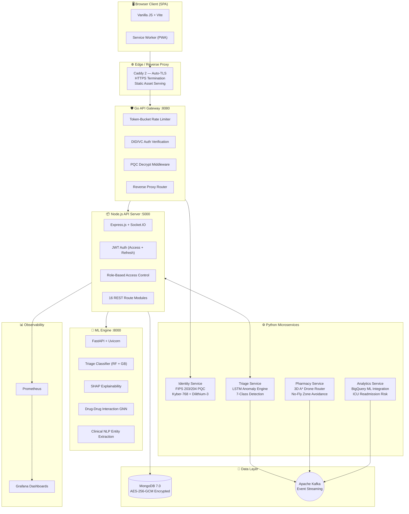
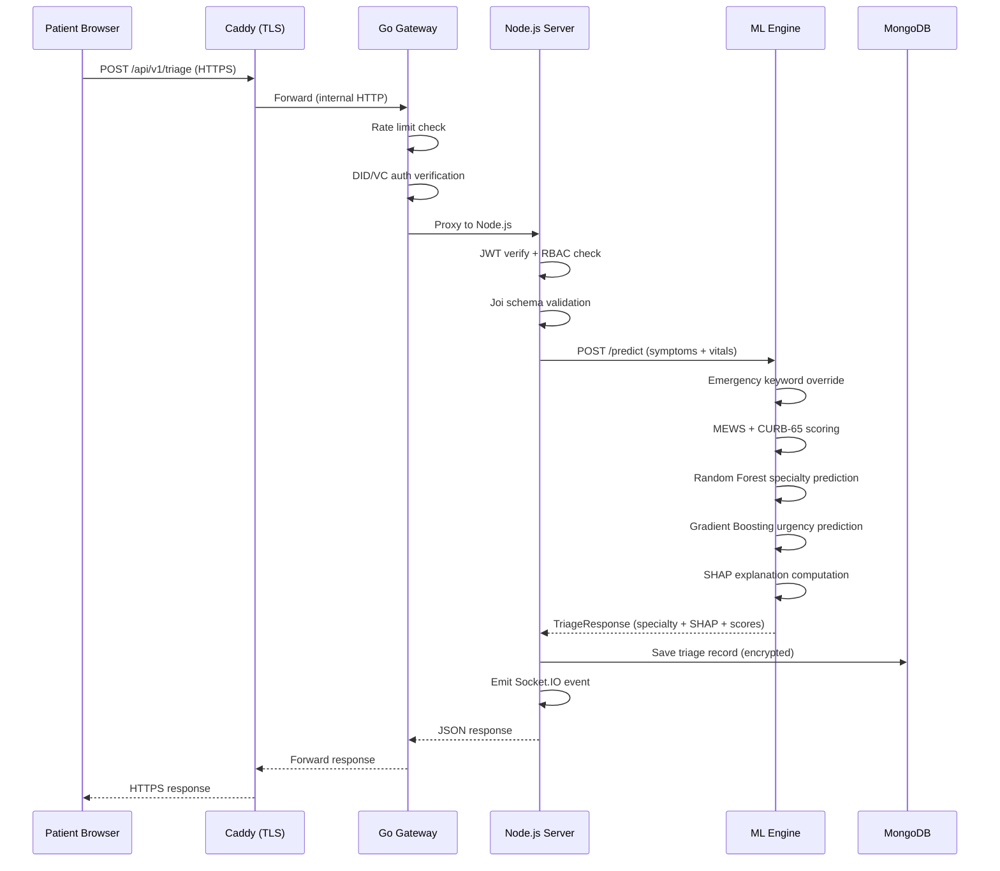
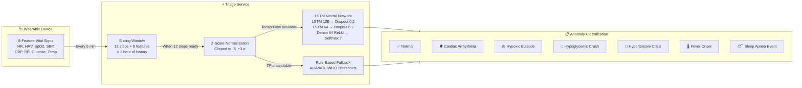
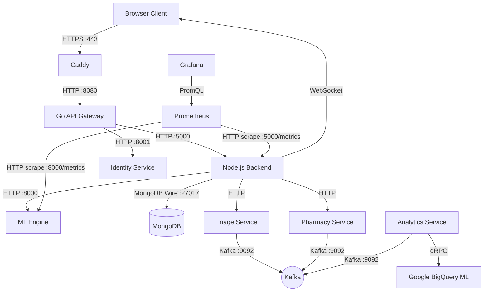
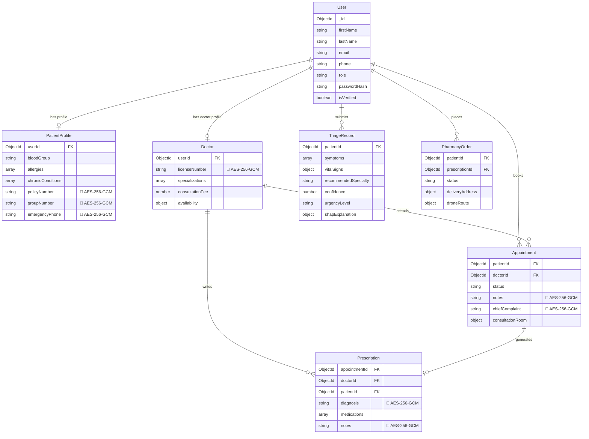
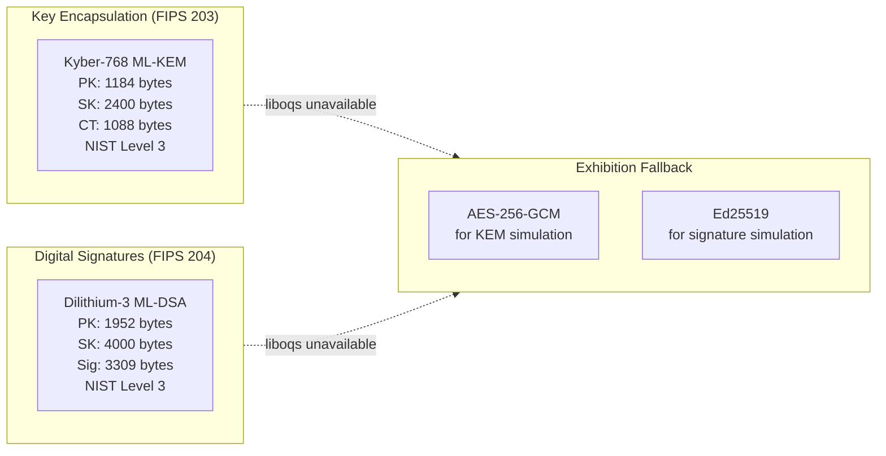
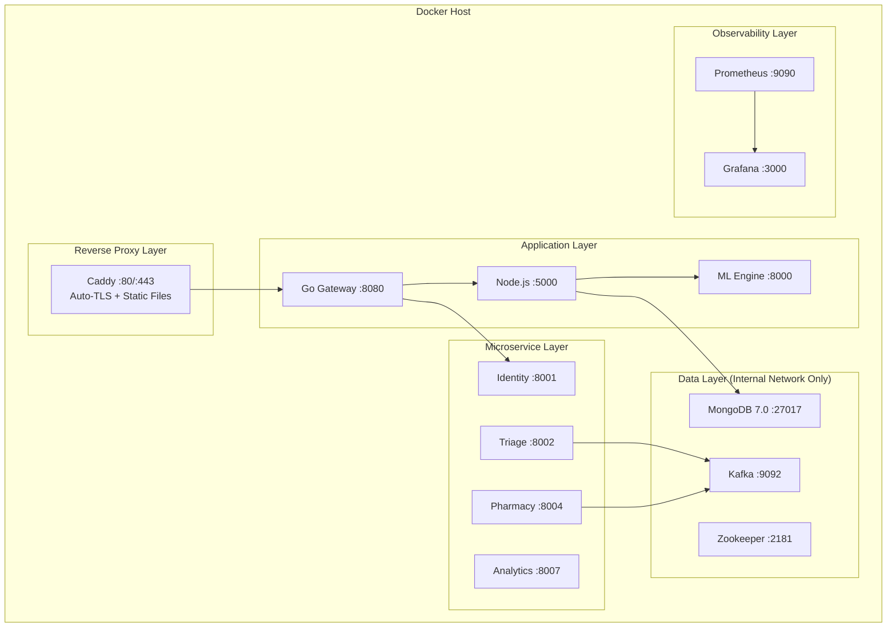

# MediFlow Enterprise — System Architecture Specification

> **Version**: 2.0.0 | **Status**: Production-Ready  
> **Last Updated**: July 2026

---

## 1. System Overview

MediFlow Enterprise is an AI-first telemedicine and e-pharmacy platform providing real-time symptom triage with SHAP explainability, post-quantum cryptographic identity verification, 3D autonomous drone delivery routing, and continuous biometric anomaly detection via LSTM neural networks.

---

## 2. Request Flow — Client to Response

Shows how a patient's symptom triage request flows through the entire system.

---

## 3. Data Flow — LSTM Biometric Anomaly Detection

Shows how continuous vital signs from wearable devices are processed by the LSTM anomaly engine.

---

## 4. Service Communication Map

---

## 5. Database Schema Overview

MongoDB collections and their relationships:

---

## 6. Security Architecture

### 6.1 Encryption at Rest
- **Algorithm**: AES-256-GCM with random 96-bit IV per encryption
- **Format**: `<iv_hex>:<authTag_hex>:<ciphertext_hex>`
- **Protected Fields**: Insurance info, license numbers, emergency contacts, clinical notes, diagnoses
- **Key Management**: 32-byte key via `ENCRYPTION_KEY` environment variable
- **Hooks**: Mongoose `pre('save')` encrypts, `post('find')`/`post('findOne')` decrypts automatically

### 6.2 Encryption in Transit
- **TLS**: Caddy provides automatic HTTPS with Let's Encrypt certificates
- **Internal**: Services communicate over Docker internal network (no host exposure in production)

### 6.3 Post-Quantum Cryptography (FIPS 203/204)

### 6.4 Authentication & Authorization
- **JWT**: Access tokens (15min) + Refresh tokens (7d) with HttpOnly cookies
- **RBAC**: Role-based middleware — `patient`, `doctor`, `pharmacist`, `rider`, `admin`
- **Rate Limiting**: Token-bucket per identity at the Go gateway level
- **DID**: W3C Decentralized Identifier verification via Identity Service (future)

### 6.5 Compliance
- **HIPAA**: PHI field-level encryption, audit logging, access controls
- **India DPDP Act 2023**: Data export (`/data-rights/export`) and erasure (`/data-rights/erase`) endpoints

---

## 7. Deployment Architecture

### 7.1 Environment Configuration

| Environment | Command | Features |
|-------------|---------|----------|
| **Development** | `docker compose -f docker-compose.yml -f docker-compose.dev.yml up --build` | Hot reload, debug logging, exposed ports |
| **Staging** | `docker compose -f docker-compose.yml -f docker-compose.staging.yml up -d --build` | Near-production, test credentials |
| **Production** | `docker compose -f docker-compose.yml -f docker-compose.prod.yml up -d` | Resource limits, no debug, Kafka replication=3, MongoDB internal only |

### 7.2 Resource Limits (Production)

| Service | Memory Limit | CPU Limit |
|---------|-------------|-----------|
| Node.js Server | 512 MB | 1.0 |
| ML Engine | 1 GB | 2.0 |
| MongoDB | 1 GB | — |
| Identity Service | 256 MB | — |
| Triage Service | 512 MB | — |
| Pharmacy Service | 256 MB | — |

---

## 8. Technology Stack

| Layer | Technology | Rationale |
|-------|-----------|-----------|
| API Gateway | Go (net/http) | Sub-millisecond auth hot-path, zero GC pauses |
| Backend API | Node.js + Express | Socket.IO real-time, rich npm ecosystem |
| ML Engine | Python + FastAPI | Async I/O, scikit-learn/SHAP/TensorFlow ecosystem |
| Database | MongoDB 7.0 | Flexible schema for healthcare data models |
| Event Bus | Apache Kafka | Durable event streaming between microservices |
| PQC Crypto | liboqs (Kyber-768, Dilithium-3) | NIST-standardized post-quantum algorithms |
| Reverse Proxy | Caddy 2 | Automatic HTTPS, zero-config TLS |
| Monitoring | Prometheus + Grafana | Industry-standard metrics and dashboards |
| Frontend | Vanilla JS + Vite | Framework-free, fast build tooling |

---

*Built for the future of healthcare. Quantum-resistant. AI-powered. Production-ready.*
