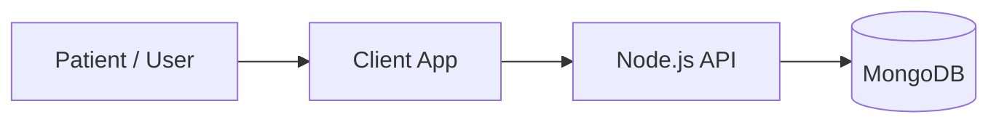

# Digital Personal Data Protection Act (DPDP) 2023 Compliance

## Data Flow Diagram

## Data Categories Collected
- Health Records
- Personally Identifiable Information (PII)
- Biometrics (where applicable)

## Retention Policy
- Chat history: 90 days
- Medical records: 7 years (as per Indian medical law)

## Consent Mechanism
- Explicit opt-in at registration.
- Purpose of data collection is clearly stated.

## Rights Provided
- **Right to Access**: via `/api/v1/data-rights/export/:patientId`
- **Right to Correction**: via standard PUT endpoints on user profiles
- **Right to Erasure**: via `/api/v1/data-rights/erase/:patientId`

## Data Processing Officer
Name: [Placeholder DPO Name]
Email: dpo@mediflow.local
Contact: +91-XXXXX-XXXXX

## Breach Notification Procedure
- Notify Data Protection Board within 72 hours of becoming aware of the breach.
- Inform affected data principals without undue delay.
